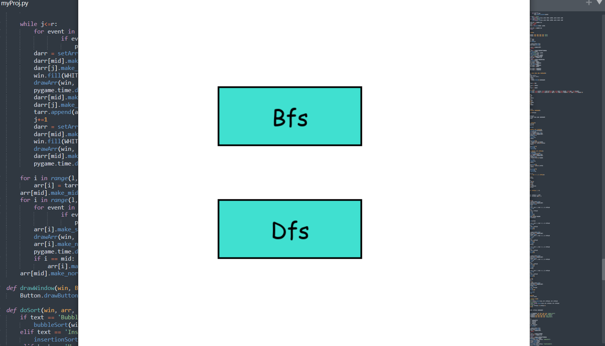
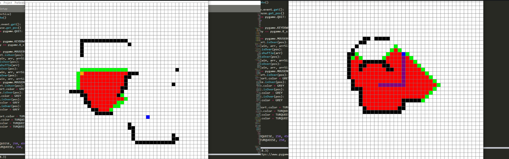
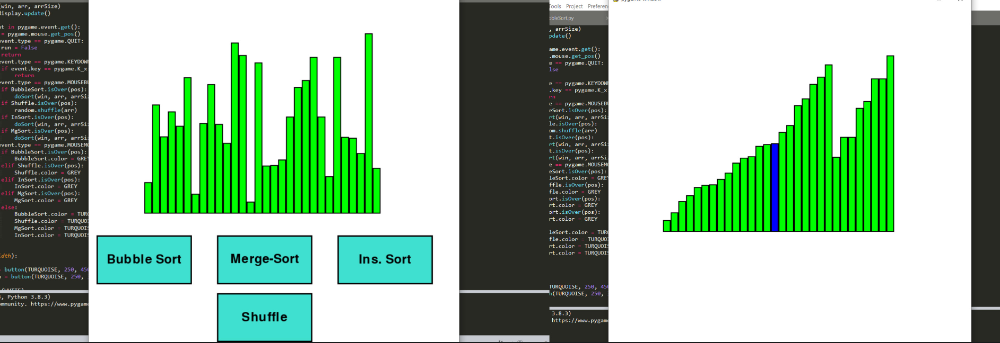

# Created by -
### Ankan Garai 21MA10009
# Sorting And Searching Visualizer
This project is a visual tool to visualize several sorting and path finding algorithms.
# Starting view
After running the program a 800x800 window will open, asking the user to choose the type of algorithms they want to visualize. User has to click the desired button.

# Searching Section 
In this section you may select any of the following searching/pathfinding algorithms in order to view it.

After you select one of the algorithms, you would be presented with a grid of size 50x50 where you can select the starting and ending points of the search. After this you can also 
add barriers in the grid , all these are to be done by selecting the appropriate cells by clicking the left mouse button. You may remove these barriers by selecting it and clicking on the right mouse button. Press SPACE bar to start the search. After the search is
complete you can clear the screen by pressing 'c' or return to the algorithms list by pressing 'x' in the keyboard.

# Sorting Section
In this section you would be presented with the following algorithms and a shuffle button where you can shuffle the bars in a random order.

After you select one of the algorithms, the process would start and you can visualize how that particular algorithm is sorting those bars. After the sorting is done you can 
press 'x' to return to the algorithms list. 

All the algorithm speeds can be controlled from the program file.
